# Architecture Overview

This document provides a high-level view of the system components and how they interact within the **marketingAssistant** project.

## Components

- **React Frontend**: Provides the user interface for interacting with the assistant.
- **FastAPI Backend**: Exposes RESTful endpoints and streams tokens back to the client.
- **Celery Worker**: Handles asynchronous tasks such as running large language model prompts and data ingestion.
- **Redis**: Serves as both message broker and result backend for Celery while caching responses.
- **Ollama LLM**: Processes prompts and generates responses.
- **Vector Store (FAISS + SentenceTransformer)**: Stores and retrieves vector embeddings for context-aware operations.
- **RAG Agent**: Coordinates retrieval-augmented generation by querying the vector store and preparing prompts for the LLM.

## Data Flow

1. Users interact with the React frontend.
2. The frontend communicates with the FastAPI backend for agent listing and task execution.
3. The backend queues long-running work through Celery which relies on Redis for coordination.
4. Documents are ingested, embedded with SentenceTransformer, and stored in the vector store (FAISS).
5. The RAG agent retrieves relevant chunks from the vector store based on the user's request.
6. Retrieved context is appended to the user's prompt before it is sent to the Ollama LLM.
7. Results are returned to the backend and streamed back to the user interface.
